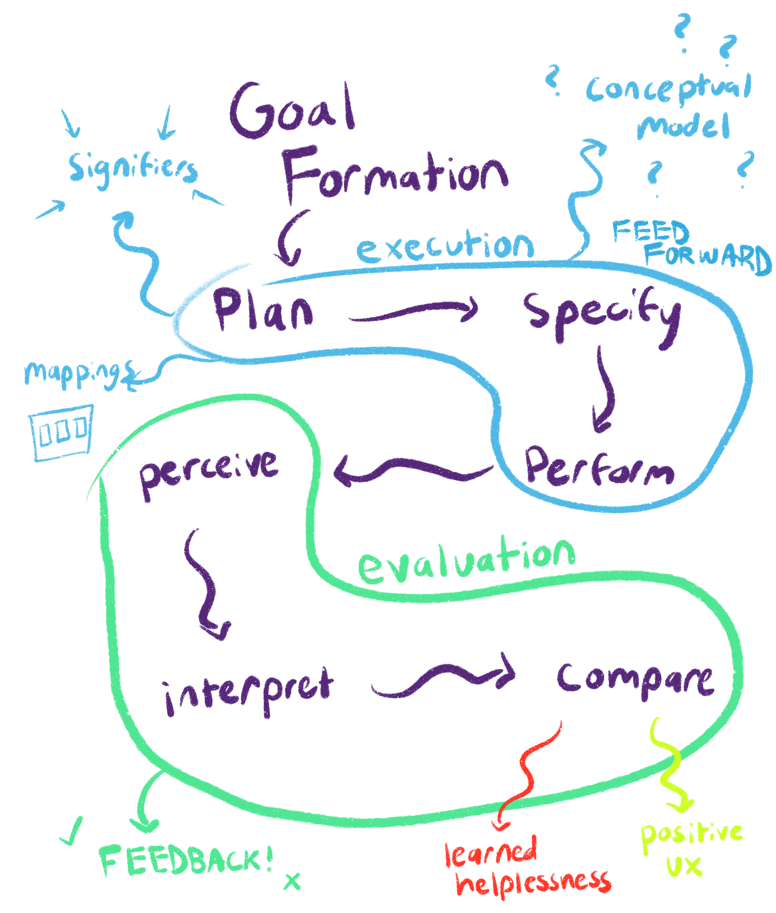

# Affordances & Signifiers II
## Reading from Don Norman's *The Design of Everyday Things* Chapter 2

To start off my flow chart, I replicated the flow of stages of action as described in the textbook. Circles around the subsets of stages separate the gulf of execution and the gulf of evaluation. From there, I tried to tie in concepts from the previous chapter by applying the principles of design to these stages. The textbook is more detailed about the role of feedback in the evaluation stage, as it gives users information with which to make their evaluations. The text spent most of its time emphasizing signifiers as a means of feedforward, the information used to guide our execution. In addition to those signifiers, I noted down conceptual models and (logical) mappings as tools users might reflect on in this stage to plan their interaction with the item. I also denoted the outcomes that may occur once a goal has been attempted (i.e. the compare phase is over). If a user struggles to use an item or cannot figure out how to revise their behavior, they may experience learned helplessness and blame themself for the designer’s poor design choices. If given the right information, they will hopefully have a positive user experience with the item in question. This flowchart optimistically leaves off what happens if a user simply has a bad experience without blaming themself.

Source: Norman, D. (2013). *The design of everyday things.* Basic Books. [Link](https://jnd.org/books/the-design-of-everyday-things-revised-and-expanded-edition/)

 I was looking for an image to convey the sense of learned helplessness that can come from failure to grasp a design that lacks proper feedback. This image portrays someone wearing an electronic watch, which reminded me of the section in the text where the author muses about how watches are housing an increasing amount of functions and becoming less straightforward to use in the process. So, this image represents the learned helplessness you might experience if you cannot intuit how to navigate your e-watch. [Original Image](https://pixabay.com/photos/man-depressed-sitting-on-the-floor-2734073/)

