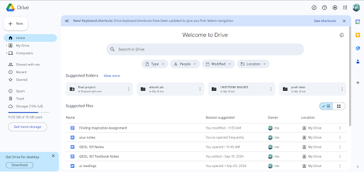
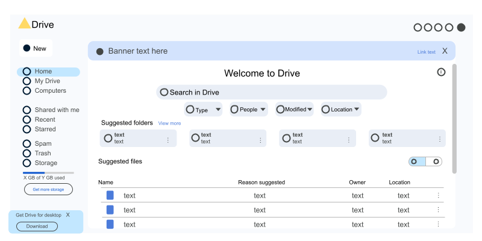
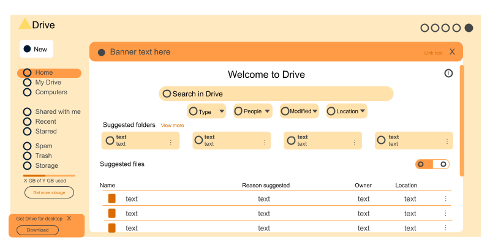
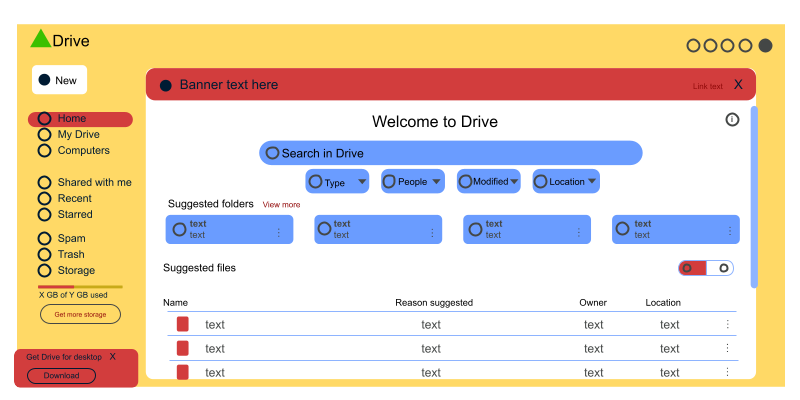
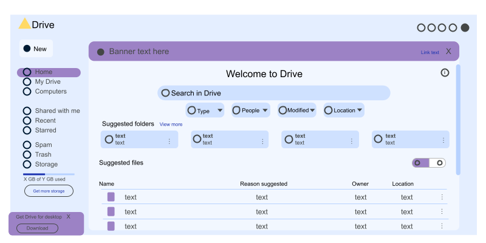

# Colors Study
## Analysis and Redesign of the Google Drive UI

This is the Google Drive UI, as seen by a browser user. It uses a primarily monochromatic palette of tones of blue, with the inclusion of white and (almost) black tones. Even the tones that appear gray are slightly blue-based. It also seems intentionally minimalistic, with its limited colors and significant use of white. 

Blue, as discussed in *The Complete Color Harmony*[^1] is the most common color for UI design. For a utility app such as Drive, it seems to be a good choice. Calm is emphasized over excitement; nothing about using Drive demands much enthusiasm. It seems to strive for simplicity in both color and navigation. Blue is also a color associated with trustworthiness, a worthy concern for a product users trust to manage their files. I would expect the designers had exactly these goals in mind for what the UI would convey: calm, simplicity, and trust.

### Replicating the UI

This replica of the UI will be used to experiment with alternate color palettes. Generally, icons were simplified to open circles. The icons on the right hand side of the page were omitted as multiple of them are logos for other products. The multicolored Drive logo will remain an exception to the color palette, as with the original.

### Alternate Palette I: Monochrome Orange

For the first alternate palette, I wanted to experiment with value-driven colors. I kept the monochrome look of the original, but adjusted it to a color aligned with the functions of Drive. Drive enables communication, work, sociability, and creation, all traits associated with orange. 

Orange is a departure from the original blue; to blue’s cool calmness, orange is close to the opposite, and can easily be seen as too much. Thus it was important to keep the brightness of this palette somewhat restrained in order to maintain the ease of viewing. Like the original, I freely allowed the use of white and black-adjacent tones to ensure this. The palette conveys more energy than the original, without becoming overwhelming.

This version of the palette was also a lesson in how colors appear differently on various screens. When viewing this on my phone screen, all the colors are undeniably orange. When viewed on my computer, the lighter tones appear almost pink. The romantic connotation of pink adds a much different feeling to the app than its intended orange shades do.

### Alternate Palette II: Complementary Chaos (Triadic)

This palette was more of an exercise in what *not* to do. Most of Google’s products have the primary colors (plus green) on their logo, including Drive. This palette is not carried into the products themselves, most of which also use monochrome, minimalist color palettes. To observe why Google did not fully embrace this design convention, I created a triadic palette using the three primary colors: red, yellow, and blue. 

Red and blue serve as calls to action, indicating something that can be interacted with or demands attention. Red indicates the simplest interactions, banners or highlights that only require a single click. Given red’s psychological spurring to fast action, this felt appropriate. This also placed the reds near the more harmonious yellow instead of blue in most instances. Blue is reserved for more thoughtful actions, such as searching for an item, opening and selecting from one of the dropdowns, or opening one of the suggested folders. The yellow is unimposing compared to its counterparts, so it was a serviceable background color.

It’s plain to see why Google kept their UIs less colorful. All the primaries together look busy and there is little meaning to be found within their clashing appearances and associations. The palette suggests something fun and unserious, quite the opposite of what the original conveys. Especially with the white included, it’s a palette that evokes clowns instead of a professional, simplistic utility app.

### Alternate Palette III: Icy Analogous

For the final recolor, I wanted to try an analogous color palette. I find the original blue fitting, but took notice that some of its blues leaned closer to green while others had purple undertones. Thus, I fully committed to one direction by incorporating blue-purple and purple alongside the blue in its palette. I also wanted to try a palette that doesn’t use pure white as its “blank” color.

I opted for purples due to their creative and perspective-seeking personality associations, which seemed in alignment with the functionality of Drive. This design should still convey simplicity and color harmony like the original, but should ideally have more visual interest and perhaps a more contemplative connotation. The brighter shades of purple used evoke the whimsy of lavender more than the refinement associated with darker purples. Like the original, the cool tones make it easy on the eye and not especially energetic, but the added purple does pop out. The prominence of the light blues, much more omnipresent than on the original, give a bit of an icy look to the interface. 

Despite having roughly the same amount of colors as the original, thanks to the loss of white, it no longer looks minimalistic and instead has a playful quality to it without being distracting. Still, this design doesn’t cast as wide a net as the original, lacking the mass appeal that a minimalist monochrome palette has.

### Conclusions
An effective color palette should be both visually appealing and aligned with the app itself. So, which color scheme is ultimately the most effective? I believe the original best matches this definition, and this comes as no shock. A company with Google’s reputation likely went through an extensive experimentation process of their own before landing on this design, and it’s easy to see why it’s appealing. The simplicity of it reflects the simplicity of the app, the calming blue is usually a safe choice, and the minimalistic color usage doesn't risk upsetting anyone's personal tastes. 

Of my own takes, I would say my monochrome orange is the best substitute. I enjoy the energy it provides the app, and I think the connotations of the color are reflective of the values this app helps people live out. There is something to be said about the diversified palettes, but at the end of the day each palette has a time and place, and in an app of Drive’s nature, less is usually more.

[^1]: Interpretations of color connotations are informed by study of *The Complete Color Harmony, Pantone Edition: Expert Color Information for Professional Results* ---
Eiseman, L. (2017). *The complete color harmony, Pantone edition: Expert color information for professional color results*. Rockport Publishers.
