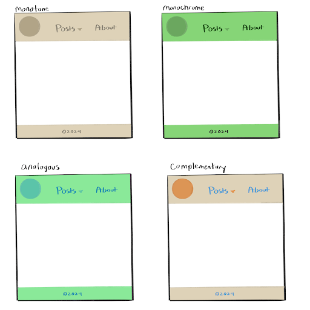
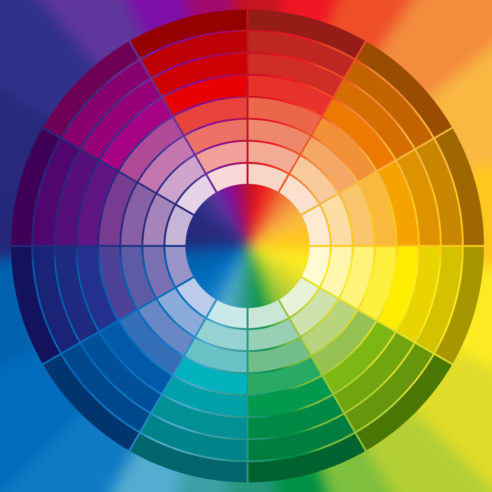

# Colors I
## Reading from *The Complete Color Harmony, Pantone Edition: Expert Color Information for Professional Results*

This section introduced some fundamental principles of color, including vocabulary such as hue, saturation, value, tone, and undertone. It also discussed the interplay between colors within palettes. The color wheel serves as an easy visual reference for the relationships between the colors, from which we can obtain several conventions for color combinations. 

A monotone palette consists of a neutral color (off-white, gray, beige, etc.) in varying tones. 

A monochrome palette is varying shades of a non-neutral hue (red, yellow, blue, etc.). 

An analogous palette uses three adjacent families on the color wheel, most popularly a primary (red, yellow, blue), secondary (orange, green, purple), and a tertiary (red purple, orange red, yellow orange, yellow green, blue green, and blue purple) that all sit adjacent on the wheel. 

Complementary color schemes make use of colors opposite each other on the wheel, and may include a neutral buffer. This can further be split into split complementary (a hue and the two on either side of its complement), triads (three equidistant hues on the wheel), or tetrads (two sets of complements for four total colors).

I found the discussion on palette selection especially interesting, so I wanted to test them out for myself by making different palettes for the same simple UI that satisfied each of the major categories (monotone, monochrome, analogous, and complementary).

For simplicity, this UI is just a generic header and footer, designed to have 3 colors in their shared palette (plus white for the negative space).

The monotone attempt is just varying shades of beige. Like the text predicts, it’s inoffensive, but not eye catching and does little to hold my interest, especially next to its more colorful counterparts. 

The monochrome version is elevated by its pop of color, but the lack of contrast still leaves something to be desired. I find my eye drawn toward others before it.

Analogous is my personal favorite of the bunch. Next to the blue-green intermediary, both the blue and green used here take on a bit of the other color, leading to a more seamless look. This one also required the most experimentation, where I found that the blue or green didn’t look right as the dropdown color because the contrast became much more apparent when they were side by side. 

For complementary, I used an orange and blue combination, along with a neutral buffer color like the text suggests. This makes the design more tame and prevents the visual vibration where the colors would otherwise overlap. Next to orange, the beige appears warmer than it does in the monotone version (it’s the exact same color!), so the blue of the text doesn’t lose its contrasting effect despite the buffer. Still, the warm orange seems to draw attention more quickly than the blue used for the text.

Source: Eiseman, L. (2017). *The complete color harmony, Pantone edition: Expert color information for professional color results*. Rockport Publishers.

A color wheel that even breaks up its hues into their varying tones, to showcase the vast possibilities that exist in color and palette construction. From [Adobe Stock](https://stock.adobe.com/search?filters%5Bcontent_type%3Aphoto%5D=1&filters%5Bcontent_type%3Aillustration%5D=1&filters%5Bcontent_type%3Azip_vector%5D=1&filters%5Bcontent_type%3Avideo%5D=1&filters%5Bcontent_type%3Atemplate%5D=1&filters%5Bcontent_type%3A3d%5D=1&filters%5Bfetch_excluded_assets%5D=1&filters%5Binclude_stock_enterprise%5D=1&filters%5Bcontent_type%3Aimage%5D=1&k=color+wheel&order=relevance&safe_search=1&limit=100&search_page=1&search_type=usertyped&acp=&aco=color+wheel&get_facets=0&asset_id=327278459)