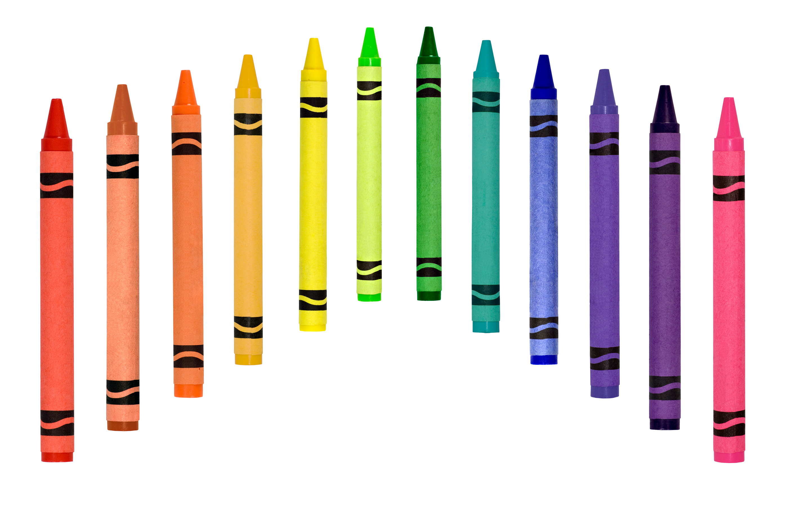

# Colors II
## Reading from *The Complete Color Harmony, Pantone Edition: Expert Color Information for Professional Results*

This section of reading covers both the conveyances of colors, and discusses the psychological ideas of what someone’s preferences in colors mean for their personality. Given the bulk of information, I decided to make myself a visual reference guide to lay out the information in a summarized manner. I chose to design this like a poster, or the concept art for what could be developed into one. I broke the drawing up into color zones where, in words, I wrote the associations of the respective color. For the personal color related information, I summarized the suggestions into a quick character drawing to accompany each section of the diagram, where the expression and pose of the character aim to convey what the reading suggests are characteristics of fans of the color. Beige is omitted from this poster due to the psychological overlap with brown, and the conveyance overlap with gray (and other neutrals). I wanted to have this so that I could see all the features of the colors side by side when considering color choices in my own works.

Source: Eiseman, L. (2017). *The complete color harmony, Pantone edition: Expert color information for professional color results*. Rockport Publishers.

I thought some crayons would be apt to match the idea of playing with colors--my earliest memories of art and learning the colors use this tool, and I'm finding a lot of the fun I had then in more thoughtful consideration of what my color choices convey. From [Adobe Stock](https://stock.adobe.com/search?filters%5Bcontent_type%3Aphoto%5D=1&filters%5Bcontent_type%3Aillustration%5D=1&filters%5Bcontent_type%3Azip_vector%5D=1&filters%5Bcontent_type%3Avideo%5D=1&filters%5Bcontent_type%3Atemplate%5D=1&filters%5Bcontent_type%3A3d%5D=1&filters%5Bfetch_excluded_assets%5D=1&filters%5Binclude_stock_enterprise%5D=1&filters%5Bcontent_type%3Aimage%5D=1&k=crayons&order=relevance&safe_search=1&search_page=1&search_type=autosuggest&acp=0&aco=cray&get_facets=0&asset_id=7309905)