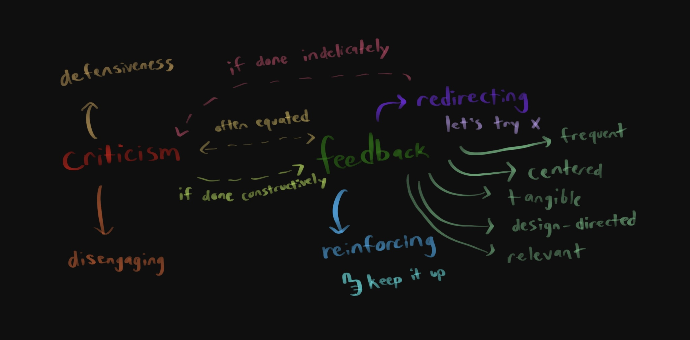

# Feedback
## Reading from InVision

For this reading, I chose to represent InVision's discussion on helpful feedback in a concept map, to help relate their ideas of good feedback and how feedback can get lost if not given properly and constructively. Two major types of feedback are identified: redirecting and reinforcing. As the names imply, redirecting feedback tell people what they can improve on, while reinforcing feedback tells them where they are already successful. Feedback is a delicate thing, as poorly-done feedback is perceived as criticism, and results in a less open exchange of ideas. Feedback is crucial to helping designers learn and improve, and being cognizant of these principles helps maximize the effectiveness of the feedback we provide. We often aren't aware of our own shortcomings, and our successes can often go unaddressed, so hearing about both helps keep us engaged.

Source: Kirkwood, J. (2018, October 4). How to give designers feedback they can actually use. InVision. [Link](https://www.invisionapp.com/inside-design/give-designers-feedback/)

The most basic form of feedback we receive on online platforms, a star rating, often doesn't convey enough to be constructive. From [Adobe Stock](https://stock.adobe.com/search?k=feedback&search_type=usertyped&asset_id=480329143)