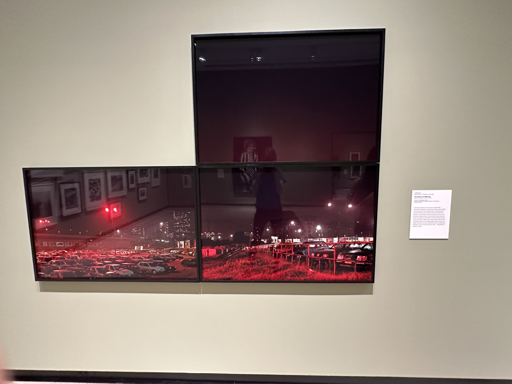

# Finding Inspiration
## Sketching a UI Inspired by Artwork

For this exercise, I visited my local art gallery, the Sheldon Museum of Art, to look over their collections in hopes of finding some inspiration for a UI design sketch. This piece, *Piazza Sigmund Freud (Milan, Italy)* by Lewis Baltz caught my eye. It is composed of three chromogenic prints that together show the parking lot of a railway station Lewis used during his time in Europe. Lewis saw an intensity in the unadulterated urban environment, unmistakably captured in the dramatic lighting of these photos.

Lewis, B. (1989). *Piazza Sigmund Freud (Milan, Italy)*. [chromogenic color prints]. Sheldon Museum of Art. Lincoln, Nebraska, United States. 
Photo taken by me.

Info about the piece's history was provided by The Sheldon. See the piece's page [here](https://emp-web-95.zetcom.ch/eMP/eMuseumPlus?service=ExternalInterface&module=collection&objectId=45100&viewType=detailView).

## What Struck Me About the Piece

### Emotive Colors ### 
The most immediately striking part of this piece was its colors. The photos are primarily red and black, with more maroon tones within the gradients between the two. Red-lit environments have been found to increase tension, depression, and anxiety compared to white-lit environments, and the shadowy nature of the vast darkness surrounding the area only intensifies these feelings. I found it fascinating that such a limited color palette could evoke such a vivid atmosphere. 

Source: https://www.frontiersin.org/journals/psychology/articles/10.3389/fpsyg.2022.938636/full

### Negative Space ###
I was drawn to this piece in part by its interesting use of negative space. An entire third of the triptych is negative space, with only a faint red-to-black gradient of the sky occupying the frame. This provides a sense of vastness: the cityscape itself seems large and sprawling, but the world around it is ever larger in a way that even the skyscrapers cannot match. The emptiness of the sky also contrasts visually with the business of the urban elements. Artist Adrian Reynolds explains that negative space has an emotional component of isolation and emptiness, which seems apt for this composition. 

Source: https://adrianreynolds.ie/negative-space-in-art/#:~:text=In%20painting%2C%20negative%20space%20can,sense%20of%20movement%20or%20tension.

### Sectioning ###
This piece is a triptych, one piece separated into three component pieces. The individual pieces are quite different in their contents--one is just the sky, one is just the parking lot, and one has a hilly area leading up to more parking. This is the intrigue of triptychs as an art form; though there is a throughline among the pieces, each individual section is also an independent piece, allowed its own unique identity. Grouping of components is an important consideration in UI design as well, and though a traditional triptych wasn't what I envisioned for the UI, it got me thinking about the separation of different elements.

Source: https://www.riseart.com/guide/2414/what-is-a-triptych#:~:text=Triptych%20art%20is%20made%20up,new%20dimension%20to%20visual%20art.

## My UI

In this UI, I hoped to replicate the intensity of the colors and the clever use of negative space. I used the photos’ color palette as a jumping off point, with black becoming my color for most components, red as the "negative space", and white for text. 

I brightened up the colors to make the UI a bit more friendly than the intense and even dangerous atmosphere of the photos by playing up the transitional maroon and having my reds lean a bit more pink so they’d be perceived as gentler. 

As for the negative space, I hoped to convey a sense of openness in this UI as the original photos achieved. I still tried to evoke a skyline with the gradient used as the background. I imagine in a full implementation there could be a subtle parallax effect as the user scrolls the page to the lower sections to enforce this idea of vastness. 

The gradient also continues off to the side where I made the choice to have the section names not in the black portion, but atop the gradient, to match the contents they are shortcuts for. This was my attempt at playing with the grouping of elements, but instead of the original piece's strict separation of its sections, I wanted to experiment with mine bleeding into each other. By being a part of the gradient, the sections still feel a part of the content they interact with.

I imagine this would be a UI for a company who wants a sleek but exciting look, perhaps something like an activewear brand. The white font on black text feels very modern, but the pinkish-red gradient has an energy that contrasts the restrained, minimal look of the simple black and white. This UI is intended for web devices, due to its reliance on horizontal width. 

## Conclusion
This exercise was a useful lesson in how getting out of your comfort zone introduces you to new design ideas. Admittedly, this piece wasn’t the first one that caught my eye--I initially looked towards others that more closely suited my usual favorites in terms of colors especially. But, there was something boring and uninspired about the sketches produced from those. Looking for something new and striking pushed me in a constructive direction, and I’m pleased with the result.