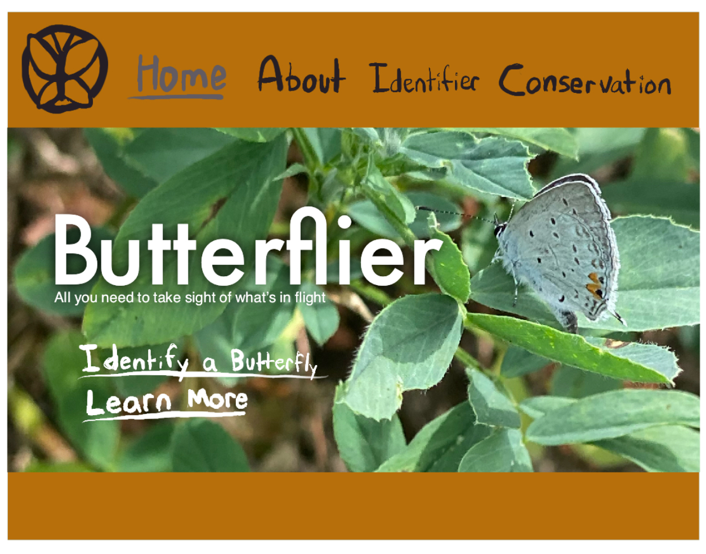

# Mockups
## Reading from Steven Krug's *Don't Make Me Think, Revisited: A Common Sense Approach to Web Usability* Chapter 7 and Garr Reynolds's *Presentation Zen: Simple Ideas on Presentation Design and Delivery* Chapters 2 and 4

This set of readings covered a lot of ground when it came to considerations for a UI design. *Presentation Zen* discusses typography and images in these chapters. The readability of font is a crucial visual consideration, achieved by ensuring a font is suitably large and favoring sans serif fonts as a way to prevent issues of clarity at lower resolutions. Images are also emphasized as an important way to draw attention to a message. Labels tell much of the story behind a photo, and styling your photo in a harmonious way with the rest of the "slide" creates a more appealing and effective visual. *Don't Make Me Think* is a bit more diversified in its approach, discussing both the importance of communication within a UI. Home pages are emphasized as a way to serve users with an overview of crucial information quickly, and taglines are also endorsed as a way to be upfront with a website's goals. So, to encapsulate all the takeaways from these readings, I decided to sketch a UI that would touch on several of them. I began by choosing a random image from my camera roll to serve as a banner, and ended up with one of a butterfly. From this, I decided that the website would be a butterfly identification database. I added a tagline and broadcast the name of the site in a large, sans serif font for readability. A drop shadow around the white text ensures it doesn't fade into the background of the image.

Sources: 
Krug, S. (2014). *Don’t make me think, revisited: A common sense approach to web usability* (Third edition). New Riders. [Link](https://dl.acm.org/doi/10.5555/2663393)
Reynolds, G. (2019). *Presentation zen: Simple ideas on presentation design and delivery* (Third edition). New Riders.

Since much of this reading makes references to billboards as a basic case for these design considerations, an image of a blank billboard felt apt. From [Adobe Stock](https://stock.adobe.com/search?k=billboard&search_type=usertyped&asset_id=327644908).