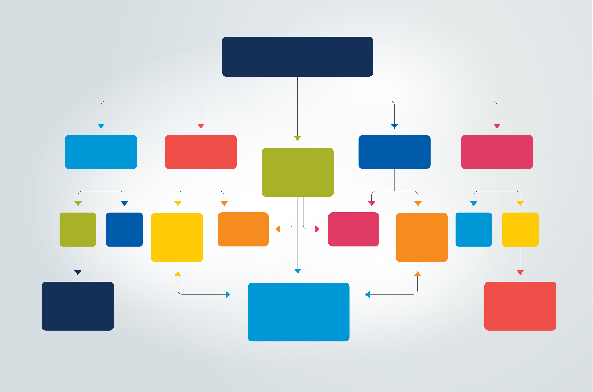

# Navigation and Values
## Reading from Steven Krug's *Don't Make Me Think, Revisited: A Common Sense Approach to Web Usability* Chapter 6 and Colin Breck's *Understanding Our Core Values: An Exercise for Individuals and Teams*

*Hierarchy* is a word that embodies both the navigation and values components of this reading.

Krug’s discussion of navigation heavily emphasizes hierarchy. It is crucial for a viewer to know where they are within a site, an especially difficult task given the relative unknowns of navigating a website compared to a physical environment. Thus, hierarchy helps direct where users are and where they can get to from that point. Users’ choices when navigating a website are usually snap judgments with little conscious thought, so helping to inform those by providing a visual indicator of the organization flow of the website can lead to more accurate choices and less opportunities to get lost. Several of Krug’s major questions to ask about website navigation, including the page’s major sections, options at the current level, and position in the scheme of things, are logically embodied by a hierarchy, and a UI is well-served by reflecting that internal logic through its visual construction.

Hierarchy is also important in conversations of values. Colin Breck describes the likely problem that a company will resonate with many core values, but must limit its key values in order to adhere to them fully. Specifically, the text describes “second-tier” values that are encompassed within the two core values selected by a company.

Sources:
Krug, S. (2014). *Don’t make me think, revisited: A common sense approach to web usability* (Third edition). New Riders. [Link](https://dl.acm.org/doi/10.5555/2663393)
Breck, C. (2020, February 2). *Understanding our core values: An exercise for individuals and teams. [Link](https://blog.colinbreck.com/understanding-our-core-values-an-exercise-for-individuals-and-teams/)

I chose this image to represent the signal-to-noise ratio. The stacked stones may represent units of signal, while the singular stone represents noise. A lot of signal is best to balance out any noise. From [Adobe Stock](https://stock.adobe.com/search?k=hierarchy&search_type=usertyped&asset_id=404762100)