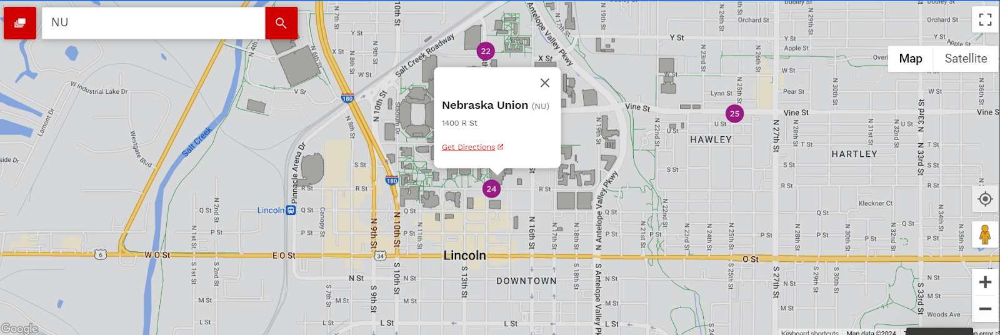

# Shneiderman & Info Organization
## Reading from Ben Shneiderman's “The Eyes Have It: A Task by Data Type Taxonomy for Information Visualizations”

This section of reading focused on data visualization and organization, particularly emphasizing the idea that a good UI should begin with an overview, enable zooming and filtering, and provide details to users on demand. This ensures that the information a user is given is tailored to what they came for, without the distractions of irrelevant information. Tools like keeping an action history can also aid users in navigating a UI, especially if they want to save the filters they applied, or go back to choose new details to demand. I chose to examine the [UNL campus map website](https://maps.unl.edu/) as an example of this UI philosophy, which I consider to be a functional if not especially appealing UI design. By default, this displays a very zoomed out version of the map where all the campuses are visible, with the shapes of relevant buildings displayed but no additional information on the significance of any individual building (overview). Clicking on one of the campuses, using the zoom tools on the side of the map, or searching for a building by name or abbreviation will narrow the field of view (zoom/filter). Only by confirming your interest by clicking on or searching for an individual building, then clicking on the “Get Directions” prompt, will a user be redirected to a tailored route between their location and the desired building (details on demand). This is also a usage of Shneiderman’s basic example of a 2-dimensional data display for a geographic map. It doesn’t follow all of Shneiderman’s advice, though: the system of undoing actions is fairly broken, only really able to achieve combining the previous and current terms in the search bar. 

Source: “The Eyes Have It: A Task by Data Type Taxonomy for Information Visualizations” by Ben Shneiderman (1996)

An image to represent the confusion and chaos that can arise from trying to navigate a UI where all the details are displayed without the user's demand. [Original Image](https://pxhere.com/en/photo/1259367#google_vignette )

