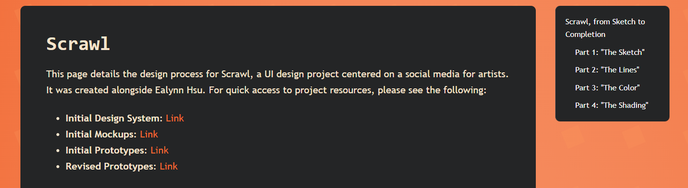

# Portfolio Design Process

This page details the design process for my portfolio.
 

## Introduction

The design of my portfolio was equal parts an exercise in working within restrictions, and in working without them. The restrictions came from the use of a Docusaurus template, where many aspects of the design were either impossible to change, or too difficult or consequential to be worth the effort of changing. The lack of restrictions came from having no one to answer to but myself when it came to the design of the website, aside from the list of core inclusions I was required to meet.

There are a number of important considerations that went into the design of this site:
 

## Navigation

I chose to kept most of the navigational structures that were built into the Docusaurus template. This was both a practical choice, as I'd be fighting against the template to restucture it, and a preferential choice, as I'd grown accustomed to the existing structure and found it sensible to categorize all the requirements. 

The most major addition was adding a new tag, Studies, to the blog to capture the assignments that belonged on the blog page, but did not suit any of the reading reflection frameworks. 

Aside from that, I consistently tagged reading reflection blog posts so they can be filtered by their framework. I also kept dating the blog posts, so they're ordered chronologically.

 

## Color

You may not have noticed, but this site is orange. Very orange. Some might say too orange.

(A preface: when I discuss the psychology of color, I'm pulling from *The Complete Color Harmony, Pantone Edition: Expert Color Information for Professional Results*.)

In all seriousness, orange isn't an especially popular color choice for UI design, and I'd say for good reason. It's not without its time or place, but it's easily seen as too much, and its psychological connotations are just about the opposite of the overwhelmingly popular, calming, and trusty blue. But I quickly found myself gravitating toward orange. Blue felt too generic, grayscale felt devoid of personality, and the rest of the rainbow didn't seem to capture the personality I hoped to achieve. I'd also experimented with the orange palette [in another exercise](https://kbreit2.github.io/katelyn-portfolio-template/blog/color-study#alternate-palette-i-monochrome-orange) and found I really enjoyed working with it, so it's something of a tribute to that. 

Orange is also the color I found best aligned with how I wanted to present myself. It is connotated with expressiveness, creativity, and energy, all things I want to convey in my designs. Which leads us neatly to... 
 

## Value Integration
For the sake of my portfolio, I chose to focus on the values of self-expression and learning. 

Self-expression, for me, came through simply by having fun with the portfolio. Many of the portfolio examples I'd seen were very minimalistic in nature, and while the clean look of this is a good way to convey professionality, I feel they often lose personality in the process. I consider myself to have a good amount of range in design, and while I'm capable of sleeker designs of that nature, they aren't how I'd choose to present myself. So, I went with a bold orange color scheme simply because it felt the most "me", and used the opportunity to hand-make the graphics shown on the home page. 

I also emphasized learning, which is a value fairly built in to the structure of this portfolio, where things like reading exercises and my takeaways are documented. But beyond that, I wanted to convey the learning theme through the site's visual identity, which inspired the desk theming on the homepage.

 

## Harmony in Affordances and Signifiers

Many signifiers are built into the Docusaurus template, so it was one aspect of the design where I had to reconcile my own design sensibilities with the existing constraints.

One major signifier I added was a new style for buttons on the site, to convey the affordance of clicking them. For sake of cohesion, these follow a pattern throughout the template's navigation buttons where hovering is required before the clickability signifier becomes apparent (in a completely free-form design, this isn't what I'd opt for, but completely removing this pattern from the template proved intensive). So, the initial button looks a bit unassuming, but has a clear action prompt that should grab the user's attention, such as a verb or an arrow:

<table>
<tc>

</tc>
</table>

The hover is where things get a bit more interesting.
<table>
<tc>

</tc>
</table>

I wanted to ensure that the hover state was difficult to miss. The text gets lighter, and a darker rounded background appears (both to ensure proper contrast is preserved, and as an additional attention-getter). This was meant as clear positive feedback for a user's interaction with the element, while visually interesting enough to entice further attention. The underline is also present (albeit not for the arrow, which does not link to anything external) as a very traditional signifier that something is being linked to by the element. Nothing clickable on the portfolio is without some sort of signifier to match that affordance.
 

## Accessibility
Orange is a difficult color scheme to pull off from a contrast standpoint. I ran Lighthouse tests in attempt to tweak the colors. It was important to me that at least one of the color modes pass the tests consistently, so I directed those efforts toward dark mode as the Lighthouse tests were yielding inconsistent results between pages for light mode. This is the Lighthouse result for the homepage:

<table>

</table>

I was also careful to include alt text on the images within my site. Keyboard-friendly controls were mostly built into the Docusaurus template, but I was careful to account for them when adding new elements, such as the carousel back and forth buttons on the home page. Whenever other miscallaneous Lighthouse warnings popped up, I took efforts to address them if they were within the scope of changes that could be made to the template. This usually came down to small things like adding titles to certain HTML elements.
 

## Usability
Fortunately, the Docusaurus template is already very usable. It has a very clean and organized look, especially on the blog posts. For my part, I tried to include subheadings (like the ones you can see on the sidebar here!) in especially long posts, and things like bulleted lists where sensible. It was also important to me that things weren't too crowded on the site, so spacing between different paragraphs or between elements I added (particularly on the home page), and things like keeping shortcuts to project links at the top of the Scrawl page were done very intentionally.

 

## Evolution

Even the design of this portfolio has evolved as I've learned more about design. Here's the first draft of the home page:

<table>

</table>

Some things have clearly carried over, like the square background and the orangeness of it all, but the final page turned out very different. Between then and now, I learned a lot about the design process and had more experience iterating on designs. The flaws of the original became clear. There wasn't much evident structure or visual hierarchy to the shape containers--I never did have a clear plan of what I'd put into them--and the contrast issues of using orange would have been greatly exacerbated by the original design. It was more minimalistic perhaps, with limited colors compared to the final product, but that did very little for its effectiveness.

The best diary of my learning is definitely the blog, though. Each entry required critical reflection that prompted me to apply my learning, rather than simply reciting it.
 

## Attributions

You can't learn much without something to teach you, so naturally this portfolio pulls from many resources. Citations for outside sources are always included where they are referenced. 

This is sometimes a link to an external source, such as a video or photo:

And sometimes it's a more formal citation:

 

## Conclusion

Perhaps it's not the most professional view to have of your portfolio, but I went into the design process with the hopes that it would be fun, both in process and result. I believe I accomplished that in this portfolio. My design vision gave me plenty of problems to solve and experimentation to do, which kept the work fresh and engaging. The end product is one I can be proud of as a testament to my progress in design, and a source of expression of myself and the things I hope to carry into my design work.