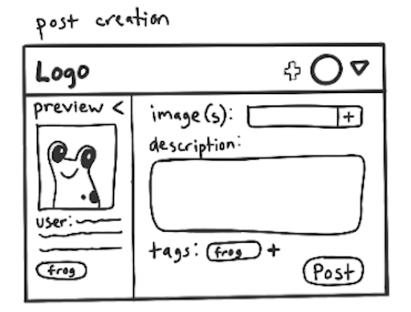
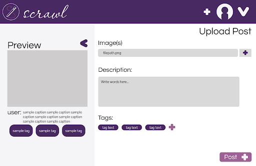
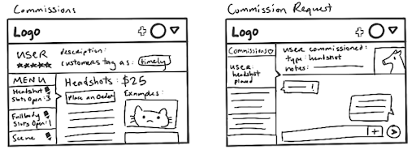
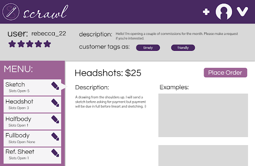
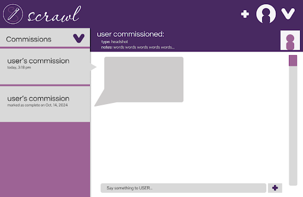

# Scrawl

This page details the design process for Scrawl, a UI design project centered on a social media for artists. It was created alongside Ealynn Hsu. For quick access to project resources, please see the following:

- **Initial Design System**: [Link](https://www.figma.com/design/bQ6iy1TsYJAkJRtRYxtTWr/scrawl?node-id=1-7&t=pGjro43KujStXEcw-1)
- **Initial Mockups**: [Link](https://www.figma.com/design/pDaIbX1vtbzajjhYeQxZoB/scrawl-2.0?node-id=0-1&t=3zchshMzA696PDFJ-1)
- **Initial Prototypes**: [Link](https://www.figma.com/design/doacDGNSpOWhEmGeNBL5Ro/scrawl-3.0?node-id=0-1&t=54vGGaLbBslWIwTa-1)
- **Revised Prototypes**: [Link](https://www.figma.com/design/sife6gfHFYzVPmL5Oye0yW/scrawl-5.0?node-id=0-1&t=qtqRFAbtbPGo5Hsc-1)

 

## Scrawl, from Sketch to Completion

Scrawl is a hypothetical social media platform geared toward artists, allowing them to share and market their work. It was designed along Ealynn Hsu, where we underwent the design process from concept to prototype design.
 

### Part 1: "The Sketch"
The first step in designing Scrawl was also the easiest: coming up with an idea. Ealynn and I quickly landed on the idea of doing something art-related. We are both hobbyist artists who have used various social media platforms to share art, and had many mutual complaints about our experiences. I had primarily worked on platforms that were not made with artists in mind, where I struggled with visibility and a lack of tailored features. Ealynn had this experience as well, in addition to some knowledge of emerging artist-centric platforms like Cara that didn't offer the same quality as traditional platforms. So, we set out to use our personal understanding of the needs of artists on social media to design a new platform that would provide tailored features, without sacrificing the streamlined experience of more conventional social media.

In concept, we hoped that our platform could avoid some of the harmful patterns of other platforms that set artists up as competitors, fighting for the limited visibility that many algorithms provide. We believe art social media should be a place to share and celebrate the works of a wide range of artists, regardless of the medium they use, their level of experience, or the “trendiness” of what they create. We also hoped to provide tools to artists to help from a business standpoint, such as ordering and managing commission work–-which would naturally be absent from apps not catered toward artists. Many of these ideals are much more plainly evident in the functionality of the app, whereas our focus was the design. Still, we attempted to communicate these as clearly as possible by including featured art and an easy-access commissions portal. 

We initially planned on designing both mobile and desktop versions of the UI, as our imagined demographic would certainly use both, but switched gears to focus solely on the desktop version. This was so we could devote our efforts to a fuller imagining of some of the features we’d include in the app. We chose to emphasize this desktop version over the mobile one because we felt it would be the best choice for building the core features. Though mobile would undoubtedly be popular with our audience, it seemed more straightforward to simplify a desktop layout for a mobile environment than vice-versa, should we ever pursue both.
 

### Part 2: "The Lines"
With our focus on a desktop design, we chose to go the route of having two users stories to allow us to flesh out multiple workflows on the platform. Both user stories centered around the charaacter of Rebecca, who we believed would resonate with our target audience in many ways. She was envisioned as a busy person, balancing a full time job and taking up art as a hobby for her own enjoyment, with hopes of expanding to sell her work for supplemental income. 

Our first workflow was to simply create a post. For Rebecca, this should be a quick action that she could start and finish on a momentary break from work. From the beginning, we envisioned the post workflow being easily accessible. We didn’t want it hidden away–-for such an integral feature, without which our social media platform would be effectively useless, we wanted it to be immediately clear to users how to share their work. Thus, the post button can be accessed from the header on any page and didn’t change much from sketch to prototype. The header was designed by Ealynn, with the prototype icons (with the exception of the logo) done by me.

<table>
<tc>

</tc>
</table>

The post creation page was also meant to be fairly standard to any social media experience. Users can choose their files, add a caption, and add hashtags to the art to help reach specific audiences. There is also a collapsable preview of the final post on the side of the page. The post creation page was designed by me.

<table>
<tc>

</tc>
</table>

Our next story centered on Rebecca’s journey to market her art. She should be able to check if she has a new commission, and view her correspondence with the customer. Artists have learned to work within the confines of many pre-existing platforms by using DMs to facilitate customer communications while transactions are managed by third party programs. Mimicking this, we initially we made our commission correspondence viewable exclusively within the DMs tab, but we’d later revisit this decision. Ealynn did the sketch and prototype for the commission page. We both had a hand in sketching the DMs portion, and I did the prototype implementation.

<table>
<tc>

</tc>
</table>
 

### Part 3: "The Color"
I’ve showcased many of the sketches and original prototypes from the project, but they were far from complete at this stage. 

We put a lot of thought into the colors of our design. For a platform for artists, we wanted something colorful and expressive, but not excessive. In fact, one of the recurrent complaints we’d hear, both between each other and with some of the friends we talked to during the discovery phase, was how dull the minimalistic direction of similar platforms was. Our specific values for the project, creativity and harmony, were especially informative to our color choices. We briefly considered orange, as its energetic qualities and creative associations felt apt for a social platform for artists. But, we ultimately landed on purple as our core color. This retained the creative associations, but had a calmer and more elegant feeling than orange. I also valued the symbolic use of purple, as it is a largely man-made conception of color–-it felt like the perfect fit for our app that hoped to be a celebration of human creativity. Ealynn contributed our logo, which I adore as a shorthand to communicate what our platform is all about. The pencil drawing conveys we’re for artists, and the curly font for Scrawl holds a lot of personality.

Though we had a strong sense of what we wanted from the design, the process was far from over. This initial prototype continued to evolve as we gained additional insights from user testing, helping us expand and refine what we’d created. Pages can be navigated between by clicking buttons, as they would on a real implementation of the site. But, functionality unrelated to the main workflows is usually not implemented and only exists on a visual level. View it below, or in another tab [here](https://www.figma.com/design/doacDGNSpOWhEmGeNBL5Ro/scrawl-3.0?node-id=0-1&t=54vGGaLbBslWIwTa-1).

<table>
<iframe title="Initial Scrawl Prototypes" className="figma" src="https://embed.figma.com/proto/doacDGNSpOWhEmGeNBL5Ro/scrawl-3.0?node-id=2006-670&node-type=canvas&scaling=scale-down&content-scaling=fixed&page-id=0%3A1&starting-point-node-id=2006%3A670&embed-host=share" allowfullscreen></iframe>
</table>

 

### Part 4: "The Shading"
Design, like any art, is a process. Though we’d laid a good foundation, there were still many steps to go before the project was complete. To begin, we needed to gain insights from potential users of the site to see if our vision matched their actual experience. Our user testing protocol was to give users a walkthrough for the site, to gain their initial read on the home page, and to ask them to narrate their way through the tasks we assigned for them to complete--the same tasks described by the user stories. 

Our initial testing was done with our colleagues in our design class. These testers had great insights for some minor tweaks, but by far the most significant takeaway was the shortcomings of our choice to nest the commission correspondence within the DMs. Neither of our peer testers were artists or customers of artists, so they weren’t familiar with the workaround we had taken inspiration from. We had taken it for granted that our users would know about this, and completely overlooked that an unfamiliar user would rightfully assume the commission correspondence could be accessed from the commission page. 

Our prototype at this stage had a well-realized vision and a mostly clear path of navigation, but it lost some of the finer details in ways that occasionally left the testers hesitating. So, we also made some small changes like including the page name on the nav bar for clearer navigation, adding some actual artwork to the site where our placeholders failed to convey the purpose of a page, and including a breadcrumb trail on additional pages.

Afterward, we set out for our real user testing. We were able to find four testers in total, friends who we knew had some familiarity with a variety of different art social media and were themselves artists. We knew we’d be able to rely on these friends to assess our creation with the same scrutiny they’d applied to other art or general social media. This group followed the same procedure as our colleague testers. 

Our testers had a mostly smooth experience and the issues they described and feedback they provided amounted to many small, yet undoubtedly experience-enhancing changes that left our main feed looking like this:

<table>

</table>

Specifically, our changes were:
<ul>
<li>Adding a logout button in the dropdown</li>
<li>Putting a circle around the add post icon</li>
<li>Replacing the dropdown icon on the nav bar with a hamburger icon</li>
<li>Adjusting the clickable area of the dropdown options</li>
<li>Adding a search bar to the site header</li>
</ul>

Some of these, like a search bar on the header and a logout button, were essential features that we’d simply overlooked since they were outside of the focus of our primary workflows-–but their absence was jarring and made the design feel incomplete. Others, like changing the dropdown icon on the header to a hamburger icon to match design conventions, editing the add post icon to have its own bubble to avoid wrongful association of it with the profile icon, and adjusting the clickable boxes of the menu options, were mostly quality of life features, but they make the design look much more professional and consistent.

There were some other excellent suggestions we got, like putting commissions into the dropdown and adding features to mark commissions as complete, which would undoubtedly be essential parts of a truly final product. But with our limited time and resources, we chose to emphasize this set of issues as a good balance of making the product feel high quality and ensuring a pleasant experience when navigating our workflows.

All in all, after our colleague and user testing, our prototype turned out like this (view in another tab [here](https://www.figma.com/design/sife6gfHFYzVPmL5Oye0yW/scrawl-5.0?node-id=0-1&t=qtqRFAbtbPGo5Hsc-1)):
<table>
<iframe title="Revised Scrawl Prototypes" className="figma" src="https://embed.figma.com/proto/sife6gfHFYzVPmL5Oye0yW/scrawl-5.0?node-id=2006-670&node-type=canvas&scaling=scale-down&content-scaling=fixed&page-id=0%3A1&starting-point-node-id=2006%3A670&embed-host=share" allowfullscreen></iframe>
</table>

For our project’s guiding values of creativity and harmony, we put great emphasis on how our UI could communicate these principles. The colors, as previously discussed, were a major contributor to this, but far from the only one. We sought to suggest creativity in our UI through the featured art, different feed options (a main feed and an exploration feed, though the latter was not fully implemented), and use of tags to maximize visibility. 

Harmony was, at least for me, the more difficult of the two to convey through the design. Like creativity, harmony can be derived from the colors–-the mostly monochromatic purple look provides a consistency through colors that are internally harmonious. The user-submitted art, which would be in all colors of the rainbow, does not disrupt this thanks to the sparing use of purple. As a generality, an off-white tone makes up the negative space, allowing the purple to feel more like an accent rather than a necessity on every pixel of the page. 

But harmony was not just a visual goal–-it was one for the community our platform was trying to foster, that we’d avoid the disheartening patterns so many social media fall into, where people with similar interests become competitors trying to fill the same niches. Tags were our main agent of harmony, meant to allow people of all artistic backgrounds–-be it experience level, medium, art style, subject material, or whatever else–-were given the same tools and the same level of baseline visibility. This was a feature I’d enjoyed on many social media platforms that has fallen from popularity in favor of algorithms that harvest more engagement by boosting the most consistent or on-trend creators.

Designing Scrawl became a very personal exercise for me, and I’m sure for Ealynn as well. For me, it became a way to reflect on my artistic journey, and the changing landscape of art social media in a way I find unfavorable and discouraging for artists, especially beginners. And as a relative beginner in the world of design, it was somewhat cathartic to build something like Scrawl as a first major project, one that celebrated the value in all art. Though Scrawl remains simply a hypothetical design, I find myself wishing something more like it really did exist, and to me that’s a sure sign Ealynn and I accomplished our goal of building something artists like ourselves could benefit from. 
